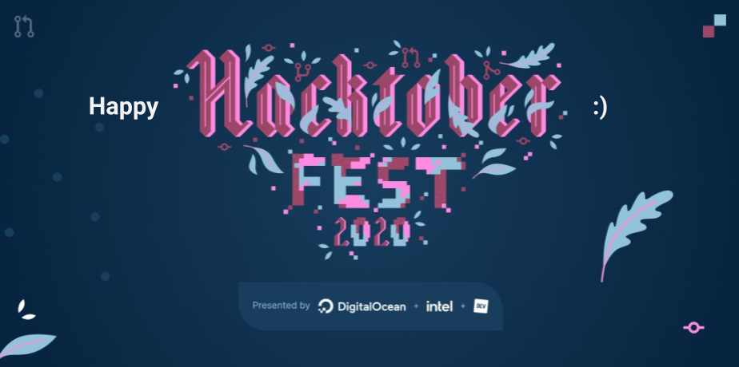

# Happy Hacktoberfest!

)


## Quick start
Welcome to the Happy Hacktoberfest repository! 

To install the current release of Happy Hacktoberfest:
```
> pip install hacktoberfest_jems
```
Now you can read a contributor's wish:
```
> hacktoberfest_jems

# John Doe wishes you a very happy Hacktoberfest!
```
## Contribution
This repository is here for you to experiment with Github and learn how to make your first Pull Request (PR).

1. Fork this project and clone it
2. In the file `hacktoberfest_jems/data/contributors.json`, add your username and a short message to celebrate Hacktoberfest.
```
    {
        "author":"your-username", 
        "wish":"your_message"
    },
```
Your message will be displayed as follows : `your-username wishes you your-message`
For example : 
```
    {
        "author":"John Doe", 
        "wish":"a very happy Hacktoberfest!"
    },
```
Would display: `John Doe wishes you a very happy Hacktoberfest!`

3. Commit and push your modifications
4. Create a PR

Congratulations! :tada: You’ve just submitted your first PR! Your PR will be reviewed and merged if it's compliant with our [code of conduct](https://github.com/Amagash/Happy_Hacktoberfest/blob/main/.github/workflows/CODE_OF_CONDUCT.md)!

### **Be careful, your PR must respect the following conditions:**

1. Your contribution must respect the [code of conduct](https://github.com/Amagash/Happy_Hacktoberfest/blob/main/.github/workflows/CODE_OF_CONDUCT.md).
2. It's your first PR to this repository.
3. You are using your own GitHub username and it's the same as the PR author.
4. Into the contributors.json file, the message must be short and respect the [code of conduct](https://github.com/Amagash/Happy_Hacktoberfest/blob/main/.github/workflows/CODE_OF_CONDUCT.md).

Now that you know the basics, you can search for other projects to contribute to. 

**Happy Hacktoberfest and Happy contributing!**
