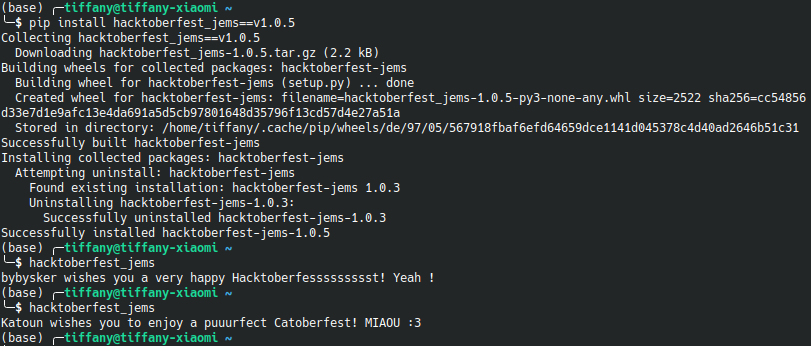
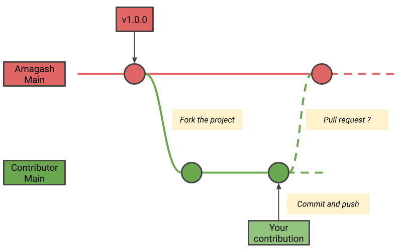

# Happy Hacktoberfest!


## Quick start
Welcome to the Happy Hacktoberfest repository! The python package `hacktoberfest_jems` is a wishing box from all contributors.

To install the current release of `hacktoberfest_jems`:
```
> pip install hacktoberfest_jems
```
Now you can read a contributor's wish:
```
> hacktoberfest_jems

# John Doe wishes you a very happy Hacktoberfest!
```
To randomly pick a new wish, simply rerun the previous command.
This is what you should see: 



## Contribution
This repository is here for you to experiment with Github and learn how to make your first Pull Request (PR).

1. Fork this project


This step will create a copy of this repository (red line) in your library of repositories. At this point, you will make your contribution in your forked repository (green line). 


Go to your repositories to check if the repository Happy Hacktoberfest has been properly forked in your library.


2. Open your forked Happy Hacktoberfest repository (or clone it). In the file `hacktoberfest_jems/data/contributors.json`, add your Github username and a short message to celebrate Hacktoberfest.
```
    {
        "author":"your-github-username", 
        "wish":"your_message"
    },
```
Your message will be displayed as follows : `your-github-username wishes you your-message`
For example : 
```
    {
        "author":"John Doe", 
        "wish":"a very happy Hacktoberfest!"
    },
```
Would display: `John Doe wishes you a very happy Hacktoberfest!`

3. Commit your modifications (and push if you cloned it)


This step will send your modifications to the main branch of your forked repository (green line).


4. Create a PR


This will create a request from your forked repository (green line) to merge your modifications into this repository (red line).



Your modifications will be reviewed by a project maintainer and will be merged if compliant with the following conditions.

### **Be careful, your PR must respect the following conditions:**

1. Your contribution must respect the [code of conduct](https://github.com/Amagash/Happy_Hacktoberfest/blob/main/.github/workflows/CODE_OF_CONDUCT.md).
2. It's your first PR to this repository.
3. You are using your own GitHub username and it's the same as the PR author.
4. Into the contributors.json file, the message must be short and respect the [code of conduct](https://github.com/Amagash/Happy_Hacktoberfest/blob/main/.github/workflows/CODE_OF_CONDUCT.md).

If everything is ok, your PR will be merged.


Congratulations! :tada: You’ve just submitted your first PR!

Now that you know the basics, you can search for other projects to contribute to. 

**Happy Hacktoberfest and Happy contributing!**
